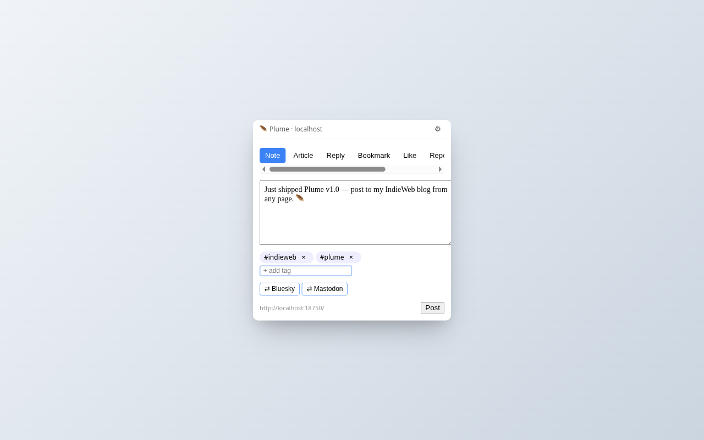
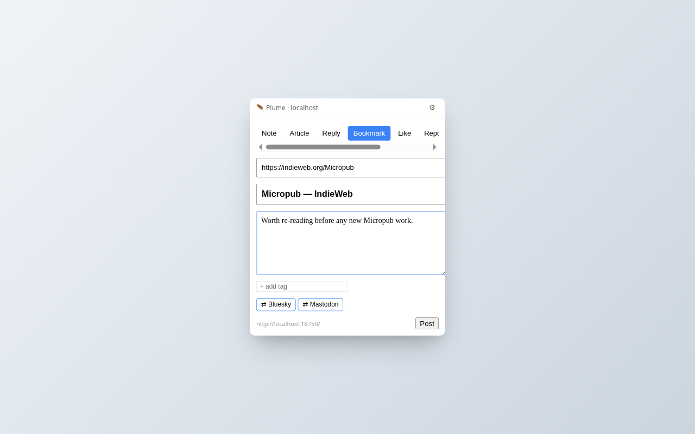
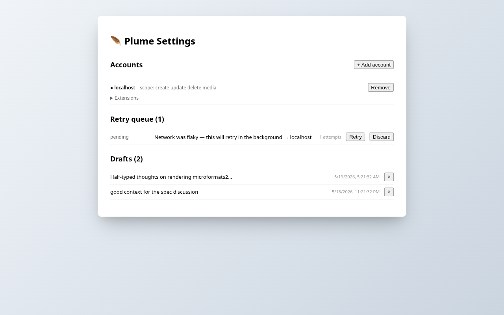
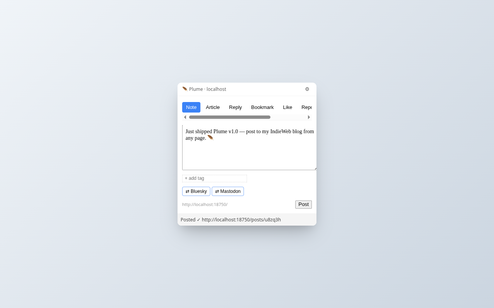

# 🪶 Plume

Cross-browser Micropub client extension. Post to your IndieWeb-compatible blog
from any page — toolbar composer or right-click context menus.

**Status:** v1.1.0 — released 2026-05-19.
[Download v1.1.0](https://github.com/rmdes/plume/releases/latest) ·
[Landing page](https://rmdes.github.io/plume/) ·
[Privacy](./PRIVACY.md)

---

## Quick composer

Click the toolbar feather. Type. Pick tags. Choose where to syndicate. Post.
The whole loop takes ~5 seconds and never leaves the page you were reading.
Keyboard shortcut: `Alt+Shift+P` (rebindable).



## Right-click to bookmark, reply, quote, like

Right-click any page, link, image, or text selection. Plume opens with the
right fields pre-filled — URL of what you're bookmarking, page title, the
passage you highlighted as a Markdown blockquote with citation.



## Drafts, retry queue, multi-account

Auto-save while you write — drafts survive across popup closes. Posts that
hit a network blip get queued and retried in the background with exponential
backoff. Connect multiple Micropub blogs and switch between them.



## Posted, with a link back

When the server confirms, Plume shows you the URL of your new post and
closes. Your content lands on your blog with whatever syndication targets
and metadata you chose.



---

## Features

- **Quick composer** in the toolbar popup — notes, articles, replies, bookmarks, likes, reposts, quotes, photos.
- **Pop-out composer** (`↗` button) opens the same composer in a tab at desk-width (480–720 px) for long-form article writing.
- **Capture from anywhere** — right-click any page, link, selection, or image to post.
- **MediaPicker** — browse files already on your server via `?q=source` and reuse them in new posts.
- **Multi-account** — connect multiple Micropub blogs, switch between them.
- **Drafts** auto-save while you type; restore on next popup open (7-day TTL).
- **Retry queue** with exponential backoff (30s → 24h) for failed posts.
- **Live-updating** queue and draft lists on the options page (subscribed to `chrome.storage.onChanged`).
- **Server-aware** — reads `?q=config`, `?q=post-types`, `?q=category` from your blog. Detects supported extension properties and surfaces "✓ Server supports" badges.
- **AI transparency metadata** — optional per-post fields disclosing AI involvement.
- **Keyboard shortcut** — `Alt+Shift+P` opens the composer popup (rebindable in browser settings).
- **IndieAuth + PKCE** via `chrome.identity.launchWebAuthFlow`.
- **Narrow permissions** — install asks for nothing broad; host permissions requested per-account.
- **No telemetry** — your data stays in your browser. See [PRIVACY.md](./PRIVACY.md).

## Install

- **Chrome Web Store:** [Install on Chrome](https://chromewebstore.google.com/detail/hcphdjeoolimpjjekegpobkhoealiige/)
- **Mozilla AMO:** [Install on Firefox](https://addons.mozilla.org/en-US/firefox/addon/plume-micropub-client/)
- **Direct download:** [v1.1.0 release](https://github.com/rmdes/plume/releases/latest) (Chrome zip + Firefox zip + source)

To load the Chrome build as an unpacked extension:

1. Download `plume-1.1.0-chrome.zip` from the release page and extract it.
2. Open `chrome://extensions`, enable "Developer mode" (top right).
3. Click "Load unpacked" and select the extracted directory.

## Build from source

```bash
bun install
bun run dev          # Chrome dev mode (hot reload)
bun run dev:firefox  # Firefox dev mode
bun run build        # Production build
bun test             # Unit tests (vitest) — 113 tests
bun run test:e2e     # Playwright E2E (chromium)
bun run screenshots  # Regenerate the screenshots above
```

## Architecture

- `core/` — pure-logic modules (Micropub HTTP, IndieAuth + PKCE, retry executor, normalization, extension detection)
- `storage/` — `chrome.storage.local` abstractions (accounts, drafts, queue, defaults, session)
- `entrypoints/` — extension surfaces (popup, options, background service worker)
- `components/` — shared Preact components (composer chips, AI metadata panel, MediaPicker)
- `tests/` — vitest unit tests (113) and Playwright E2E (3 on chromium)
- `scripts/` — capture-screenshots, lint-fetch privacy enforcement

Built with [WXT](https://wxt.dev) + [Preact](https://preactjs.com) +
[TypeScript](https://www.typescriptlang.org). Linted with ESLint + Prettier.

Project-specific conventions and gotchas are documented in [CLAUDE.md](./CLAUDE.md).

## License

MIT — see [LICENSE](./LICENSE).
